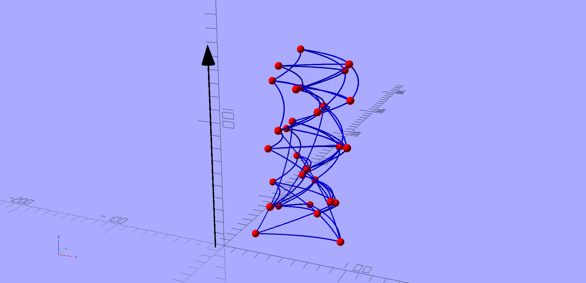

= A Hypergraph-based Decentralized Infinite State Machine Model Compatible with Semantic Spacetime and Promise Theory
Steve Traugott <http://github.com/stevegt>; Donaldo Almazon; JJ Salley; Rebecca Snyder <https://github.com/RebeccaSnyder505>; Angela Traugott
:stem:
:xrefstyle: short
:toc: macro

== Abstract

We introduce a system that executes a worldline discovery process.
The system is a decentralized infinite state machine in which
each agent manages its local state and interacts with other agents by
making promises about state transitions in the past or future on one
or more timelines. 

This process appears to be usable for general-purpose computing as
well as for organizational and community governance, including
decentralized consensus formation.  

toc::[]

== How to Read this Document

This document is split into two major parts -- a <<Discussion>>
section that is written in a more accessible narrative style, and a
<<Theory>> section that is more technical and formal.  

== Discussion

Feel free to skip to <<<The Merge Problem>>> if you're in a hurry.

=== History and Motivation

*-- By Steve Traugott*

The year was 1994.  There I was, standing in the former boardroom of a
major international bank, looking at the README for an early version
of Mark Burgess's cfengine.  I was thinking "this is close to what we
need, but I'll not be able to get it past internal culture."  

In that year, the terms "open source" and "infrastructure" had not yet
been applied to computing. About 1% of the world's population was
using the Internet, most software was still distributed on tape or
floppy disks, Linux was at version 0.99, and git was over a decade in the
future.

Derivatives trading was becoming the most profitable business in
global finance. The bank had acquired a major competitor and vacated
the competitor's boardroom, turning it into a software development
area for derivatives trading. It was generally understood that a
trading operation needed to write their own application code to be
competitive, but that philosophy had not yet penetrated internal
culture around systems infrastructure or administration.  When it came
to the underlying infrastructure, the bank's cultural preference was
for commercial software with support contracts.

I was working on a project to automate the management of the bank's
global derivatives trading systems -- at that time, this was hundreds
of UNIX desktops and servers worldwide, built by hand, installed from
tape.  

Those UNIX machines were considered bleeding-edge, part of the
"client-server" trend that was occupying increasing mindshare in IT at
the time.  The bank's older systems consisted of mainframes and
minicomputers, with either terminals or DOS/Windows on desktops.  The
internal network consisted of 56k links between continents carrying a
mix of SNA, X.25, IPX, and TCP/IP traffic.  Thicknet was still in the
walls, and daisy-chained coaxial Ethernet was under the desks.

For automating UNIX administration, there was very little prior art to
draw from -- the MIT Athena project was the only other large-scale
system management project I was aware of.  The bank's internal network
was not yet connected to the Internet -- any research I could do was
limited to my dialup UUCP and PPP connections at home.  The USENIX
LISA conferences were the only place I knew of where large-scale
systems administration was being discussed, but even there most of the
conversation was around narrowly-focused problems such as NFS tuning
or sendmail configuration, rather than a holistic approach to managing
a large environment using code.

At that time, most systems administrators were not yet programmers --
the concept of "infrastructure as code" was several years in the
future. <<iac>>

Operating systems vendors were not helpful -- this was the middle of
the "UNIX wars," and vendors were not as interested in helping
customers automate a real-world environment made up of a mix of
competing vendors' systems.  The few automation tools that were
commercially available were better suited for the vendor's own
internal testing, focused primarily on automating installation and
upgrades for a single operating system, ignoring applications, user
data, and heterogeneous environments.  

The upshot of all of this was that, at the time, in a typical company,
the ratio of systems administrators to machines was about 1:10.  At
that ratio, scaling to the size of today's cloud providers would not
have been possible.  The only way to scale was to automate.

Worse than scaling issues, that 1:10 ratio implied hand-built systems 
that were not reproducible -- in a typical environment, each machine
was unique as a snowflake.  It was not uncommon for a machine to be
built by hand, and then for the administrator to forget what they had
done to build it.  The only way to find out was to look at the machine
and reverse-engineer it, but that, too, was problematic -- which of
the many changes made to the machine were worth looking at?  

Even worse, unique machines meant that software could not be tested in
a realistic environment before deployment.  Because the test and
production environments were different, software that worked in test
often failed in production.

Finally, a lack of automation means that application installation and
upgrades were both time-consuming and error-prone.  Even in an
environment where the machines were identical, if application
installation was manual, then deployment time was proportional to the
number of machines, and the likelihood of error was proportional to
the number of steps in the installation process.  

These issues were particularly acute in a global trading environment,
where time-to-market of new code is critical.  If you can't deploy new
code quickly, your competitors will arbitrage away the opportunity the
new code was meant to address.  And of course if you deploy new code
quickly but incorrectly, you can crash a trading floor if not an
entire market. <<knight>>

"Maybe I should just use Makefiles." After several weeks of testing
alternatives, I found myself grasping for the simplest thing that
could possibly work.  "I'll just have each machine run 'make' at boot
and from cron".  I had recently left a contract at UNIX System Labs
(USL), where an extensive Makefile-based system was used to build the
UNIX kernel and utilities -- one 'make' command would build UNIX on
any of the dozens of hardware platforms supported by the codebase, and
I still had 'make' on my mind.  I hadn't yet fully realized Makefiles
were a Turing-complete functional programming language, but I felt
pretty sure they should be able to do the job.  

I started hacking on the idea on my little HP DOS 5.0 palmtop on the
train to and from work.  I had a working prototype in a few days.  The
end result was a little shell script that pulled a bigger shell script
from a central server.  The bigger shell script would mount an NFS
filesystem to get the Makefile and related assets, and then run 'make'
to configure the machine.  It was simple, and it worked great.

The Makefiles worked.  We used them to build the next trading floor,
and with generous support and encouragement from George Sherman, I was
able to get in contact with my counterparts on other continents, hire
Joel Huddleston and then a larger team, and together we built and
rebuilt trading floors like cookie cutters during the course of the
international bank mergers and acquisitions of the 1990s.  

The last trading floor I worked on went live in April 1997, and the
following year I left the bank to move to the US West Coast so I could
focus on distributed systems and the Internet.  I had long wanted to
work on better, non-heirarchical systems for coordinating human
effort, and I felt that the bank was not the ideal place to do that. I
also wanted to get on with life -- I had been working 60-100 hour
weeks for years and was ready for a change.

I finally met Mark Burgess in 1997, at my first USENIX LISA
conference. He held a BoF on cfengine, and the room was packed.

While I was at NASA Ames Research Center in 1998, I was finally able
to install cfengine in a production environment -- we used it to
manage the supercomputers in NASA's Numerical Aerodynamic Simulation
(NAS) facility.  Doing this gave me some ideas for how to improve the
tool for mission-critical environments -- more on that in a bit.

Meanwhile, Joel and I decided to describe the Makefile-based system we
had built at the bank, mentioning it in the 1998 USENIX LISA
proceedings in our "Bootstrapping an Infrastructure" paper.
<<bootstrapping>>

Mark presented cfengine and his concept of "Computer Immunology" at
the 1998 USENIX LISA conference, and I was quite taken with the idea.
The concept of "self-healing systems" had been a frequent topic of
discussion in our group at the bank, and I was glad to see that
someone else was thinking along the same lines.

It wasn't until an incident in late 2001 <<cfengine2wks>>, when 
attempting to bring the lessons learned from NASA to cfengine, that I
realized that Mark and I had been working toward the same goal from
different directions -- and it wasn't until that moment that I
realized how much others would perceive those different approaches as
a deep divide.  This perception would soon fuel tribalism in the
systems administration community, blocking progress in the field,
disrupting careers and lives.

The short version is that, as a rough approximation, Mark's
approach was a variant of Lambda Calculus, and mine was a variant of
Turing Machines. Alonzo Church and Alan Turing demonstrated in the
1930s that these two models are equivalent in terms of computing
power.  <<church-turing>>  More on this in <<Appendix A>>.

Lance Brown and I attempted to address the Turing-related aspect in a
2002 LISA paper titled "Why Order Matters: Turing Equivalence in
Automated Systems Administration."  <<ordermatters>>   While the
long-term response to the paper has been positive, the short-term
reaction was decidedly not.  I won't go into the gory details here.

On top of the tribal drama, I was bothered by the thought that much of
the controversy was about the wrong thing.  I was pretty sure that the
centralized systems that were the subject of debate were not the
future.  I was also pretty sure Mark was thinking the same thing; he
later started firming up his own thoughts in public with his Promise
Theory work.  <<promisetheory>>

As far back as the Challenger disaster<<challenger>>, I've been
convinced that centralized systems are on the wrong side of history.
The universe is not centralized, but instead exhibits complex,
emergent behavior based on simple rules and local interactions.
Centralized systems are not well-suited to understanding or managing
complexity, but are instead fragile, brittle, prone to corruption and
catastrophic failure.  

The Internet itself is largely a decentralized system, but the tooling
we were all working on and arguing about at LISA was optimized for
building and managing centralized systems, using the Internet as a
substrate. I believe this shortcut we've taken has led to a lot of the
problems we see today with Internet-based systems and services.  There
are even RFCs that raise this concern, dating as far back as <<XXX>>

I discontinued my attendance at LISA and decided to not publish any
more papers on the subject for a while. I thought it might take
several years for the systems administration community to make the
transition to a more code-driven approach, which itself would be a
prerequisite for a decentralized approach.  

I was pretty close -- Andrew Clay Shafer and Patrick Debois started
the DevOps movement in 2009, Stephen Nelson-Smith published "Test
Driven Infrastructure with Chef" in 2011, and finally Kief Morris
published "Infrastructure as Code" in 2016.  These were quickly
followed by "The Devops Handbook" and "The Unicorn Project" by Gene
Kim, Jez Humble, John Willis, and Patrick Debois.  

While all this was happening, I continued to work on the problems of
decentralized systems myself, trying different approaches within my
own business infrastructure.  Chris Buytaert and Toshaan Bharvani
invited Mark Burgess and Luke Kanies to speak at the Ghent DevOpsDays
conference in 2018, and then invited me in 2019 -- it was interesting
to see that Mark, Luke, and I all included in our talks words to the
effect that the tribalism had become too much and really needed to
stop.  

When 2020 brought into stark relief the problems of centralized
systems not being able to handle science and technology problems at
global scale, I started funding teams of folks to work with me.  One
of those efforts is the Community Systems Working Group <<cswg>>, and
this paper is a product of that group.

=== The Merge Problem

A key problem in decentralized systems is the consensus merge problem
-- how can we incentivize a group of agents to agree on a decision,
and how do we know when agreement has been reached?  

Market-based consensus mechanisms use price discovery to form
consensus, but only for problems that can be expressed in terms of
prices, quantities, and other numerical values.  

Operations Research methods such as Real Options Analysis can be used
to form consensus, but again only for problems that can be expressed
in terms of numerical values.

Blockchain-based systems use numerical mechanisms such as
proof-of-work and proof-of-stake to form consensus regarding the next
block in a chain, but the choice of the next block primarily serves to
prevent double-spending, and is often unrelated to the problem being
solved by any higher-layer dapp.

File version control systems can be used for non-numerical consensus
merge problems, but they do not scale well to large groups or complex
decisions.  

Git, for example, is currently dominant in the software development
industry, but is nearing 20 years of age as of this writing, and was
itself a reimplementation of a system that was already several years
old at the time <<bitkeeper>>.  Git was a step toward decentralized
systems, but is limited in feature set, optimized primarily for small
files and small groups of developers with public IP addresses, and
otherwise is burdened by the workflow and user interface it was
designed to mimic. These shortcomings have been to some extent
addressed by the use of centralized services such as GitHub, GitLab,
Gitea, and Bitbucket, but using centralized services to work around
the limitations of a decentralized system is not a good long-term
solution.

With git, the merge problem is solved by having humans propose and
approve changes. The tool attempts to help with line-based merging,
without any context regarding the meaning of the text or problem to be
solved, and gives up quickly in case of conflicts. It's up to human
reviewers to provide intent and context, supported by test cases,
documentation, issue comments, and other artifacts that are external
to git itself.

Finally, the recent advent of more capable large language models
(LLMs), both closed and open source, has brought with it the ability
to write tools that can analyze and propose merges of text, taking
into account meaning, context, and intent.  These tools can help solve
the merge problem for non-numerical decisions, reducing the
need to boil problems down to numbers, providing an advantage over the
above numerical methods as well as over earlier file-based version
control systems such as git.  

Decentralization needs to be applied to LLMs as well, to prevent
centralization of power and control over the tools that are used to
make decisions.  

In this paper, we attempt to bring together the principles behind
basic computing theory, Infrastructure as Code, Promise Theory,
Semantic Spacetime, DevOps, version control, and LLMs to propose a new
model for decentralized systems that can handle both numerical and
non-numerical consensus merge problems at global scale.

The synthesis of these ideas can lead to a new way of thinking about
computing itself, particularly networked computers and how we use
them.  By extension and of greater importance, the people and
organizations that use networked computers (the entire developed world
at this point) should be able to benefit from the resulting better
tools for communications and governance.

=== World Line Discovery Process

It appears that we can incentivize agents using a system similar to
that of Promise Theory, where agents make promises and evaluate each
other based on the promises they keep.

It also appears that we can discover consensus among agents by
observing the promises they build on.  Roughly speaking, if Bob makes
a promise that is dependent on Alice's promise, then we can infer that
Bob accepts Alice's promise as true.

It may be helpful to think of a promise as an assertion of fact as of a
particular point on a timeline, with veracity equal to true, false, or
undecided.  As agents add promises to a timeline, they build a
consensus about the state of the world at earlier points on the
timeline.  This is a generalization of the more limited concept of
blockchain consensus, which is limited to the next block in a chain.

In contrast to a blockchain, where there can be only one "next block",
it appears we can model the universe as a hypergraph, where each node
in the graph is a state of some part of the universe, and each edge in
the graph is an action taken by an agent to transition from one state
to another.  

Mark Burgess discusses a similar model in <<sst1>>, using the concept
of world lines to represent states and transitions in a spacetime
model.  Figure 41 of that document shows a notional X/Y plane of
states in space, and a Z axis of time moving upward.  Our own attempt
at a more detailed graph, showing more states and transitions, is
<<fig:3dhypergraph>>. 

.3D hypergraph with states and transitions moving upward in time
[[fig:3dhypergraph]]

It's important to note that the X/Y plane in these illustrations is a
simplification -- it's more useful to think of this plane as having
more than the two X and Y dimensions we can easily visualize or
illustrate.  

In particular, the state of a thing can be many-dimensional.  For
example, the location in cartesian space of a particle is a
three-dimensional state.  The context of a block of text as used in an
LLM is a vector of word embeddings; the embedding vector for the text
block may have hundreds or thousands of dimensions.  In all cases, the
location of a thing in its state space can be described using a vector
of coordinates. <<sst1>><<sst2>><<sst3>>

For a practical example, consider a git repository.  The repository
contains the history of a set of files.  This history is modeled as a
hypergraph, where each node in the graph is the state of a single
file, a tree of files, or a commit message, and the edges in the graph
represent are the commits that transition the repository from one
state to another.  The repository is an infinite state machine, as it
can have an unbounded number of commits over time.  The graph is
decentralized, as each agent (developer) manages their own local state
and interacts with other agents by making promises about state
transitions on one or more timelines (branches).  The merge problem is
the problem of reconciling the promises (commits) made by different
agents (developers) on different branches.  

== Theory

=== A Generic Language for State Transitions

We propose a generic language for describing state transitions. This
language uses a tuple format to capture promises about function
execution.  Multiple tuple formats could work; one might be as follows:

`(f1, in, inerr, out, outerr, rc, f2)`

Where:

- f1: The function currently being executed.
- in: Input to the function.
- inerr: Any input error that the function needs to handle.
- out: The expected output of the function.
- outerr: Any output errors generated by the function.
- rc: Return code indicating the result of the function (e.g., success or failure).
- f2: The next function that will be executed in the state graph.

This tuple asserts (or promises) that "function f1, given input in and input error inerr, will always produce output out, output error outerr, a return code rc, and a new function f2 to execute next."

The tuple is signed by the local kernel responsible for controlling function execution. The signature of the kernel represents the promise of the kernel to guarantee the behavior specified by the tuple. This approach aligns with Promise Theory, where only the agent (in this case, the kernel) can make promises.

It's worth noting that this tuple format is also descriptive of a
stage in a "pipes and filters" system, where the function is a filter
and the input and output are streams of data.  We suspect that the
pipes and filters model is a special case of the more general
state-transition model we are proposing here.

XXX stop here

To enable ISM compatibility with Promise Theory and Semantic Spacetime, we propose a generic language for describing state transitions. This language uses a tuple format to capture promises about function execution. The proposed format is as follows:

`(f1, invars, outvars, f2)`

Where:

1. **f1 (Current Algorithm/State):**
   - **Definition:** Represents the current algorithm or function that the agent (e.g., an ISM kernel) is executing. This is more than a simple state variable; it's an active process or behavior.
   - **Role:** Serves as the starting point for processing. It encapsulates both the logic and the internal state of the agent before any new input is processed.

2. **invars (Input Variables):**
   - **Definition:** A set of input variables provided to **f1**. These variables can be simple data types or complex, nested structures (akin to Lincoln Stein's *BoulderIO* streaming of nested variables).
   - **Role:** Act as the external data or stimuli that **f1** processes. They influence how the agent's current algorithm operates and can lead to state changes.

3. **outvars (Output Variables):**
   - **Definition:** The set of output variables produced by **f1** after processing **invars**. Like **invars**, these can be nested and complex.
   - **Role:** Represent the results of the computation or transformation performed by **f1**. These outputs can be consumed by other agents or used for further processing.

4. **f2 (Next Algorithm/State):**
   - **Definition:** The algorithm or function that the agent will execute next. **f2** may be the same as **f1** or a modified version, depending on internal side effects during processing.
   - **Role:** Captures the agent's new state after processing. If executing **f1** with **invars** leads to internal changes (e.g., updates to internal variables), these changes are reflected in **f2**.

==== How the Model Works

- **State Transition Process:**
  1. **Processing Inputs:** The agent uses **f1** to process **invars**.
  2. **Producing Outputs:** The processing yields **outvars**, which are the outputs or results of **f1**.
  3. **Internal Side Effects:** While processing, **f1** may undergo internal changes (side effects), leading to a new state (**f2**).
  4. **Next State:** The agent transitions to **f2**, which incorporates any modifications from the side effects. If there are no side effects, then **f2 = f1**.

==== Key Characteristics

- **Algorithms as Stateful Entities:**
  - Both **f1** and **f2** represent not just functions but the state of the agent's processing logic, including any internal variables or configurations.

- **Emphasis on State Transitions:**
  - The model focuses on how the agent's state evolves over time, rather than viewing functions as stateless operations.

- **Internal Side Effects:**
  - Changes within **f1** during processing are considered side effects that lead to **f2**. This highlights the dynamic nature of the agent's behavior.

- **Deterministic Promises:**
  - The agent makes a promise that, given **invars**, it will produce **outvars** and transition to **f2**. This aligns with *Promise Theory*, emphasizing reliable and predictable interactions.

==== Relation to Promise Theory and Smart Spacetime

- **Promise Theory (PT):**
  - **Autonomy and Local Control:** Each agent independently manages its state transitions based on local inputs, adhering to PT's principle of autonomous agents.
  - **Promises as Commitments:** The agent commits to specific behaviors (processing inputs to outputs) without being controlled by external entities.

- **Smart Spacetime (SST):**
  - **Spacetime Framework:** The model maps the temporal evolution (time) and the arrangement of agents and data (space).
  - **Interacting Agents:** Agents interact through **invars** and **outvars**, influencing each other's states over time.

==== Benefits of the Model

1. **Modularity:**
   - Agents encapsulate their processing logic and state, making the system easier to understand and maintain.

2. **Scalability:**
   - Decentralized management of state allows the system to scale without centralized bottlenecks.

3. **Adaptability:**
   - Agents can evolve over time as **f1** transitions to **f2**, enabling dynamic behavior.

4. **Transparency:**
   - Explicit representation of inputs, outputs, and state changes enhances clarity.

==== Practical Applications

- **Version Control Systems (e.g., Git):**
  - **f1:** Current commit hash (repository state).
  - **invars:** Set of changes (deltas) to apply.
  - **outvars:** May be minimal or empty; the focus is on state transition.
  - **f2:** New commit hash after applying changes.

- **Data Processing Pipelines:**
  - **f1:** Current data transformation function.
  - **invars:** Input data stream.
  - **outvars:** Transformed data.
  - **f2:** Updated function if the transformation logic changes due to processing.

- **Distributed Systems:**
  - **f1:** Current state of an agent or service.
  - **invars:** Messages or requests from other agents.
  - **outvars:** Responses or actions taken.
  - **f2:** New state after processing messages.

- **Machine Learning Models:**
  - **f1:** Current model parameters.
  - **invars:** Training data batch.
  - **outvars:** Updated model performance metrics.
  - **f2:** Model with new parameters after training.

=== The Role of the DISM Kernel in State Transitions

The tuple should be signed by the local DISM kernel hosting f1, rather than by f1 itself. The DISM kernel acts as the agent making promises about state transitions. It provides the runtime environment for functions (f1, f2, etc.), and is able to influence their behavior, therefore functions should be considered components of the kernel, rather than independent agents themselves.

== Implementation 

=== Encoding

To encode the promises (claims) made by agents within the DISM framework, the following encoding standards are suggested:

==== CBOR (Concise Binary Object Representation)

**CBOR** is a binary data serialization format that is designed to be small in size and fast to parse. It is well-suited for encoding structured data like promises because of its compactness and flexibility.

- **Advantages:**
  - **Efficiency:** Binary format reduces the size of the encoded data, which is beneficial for distributed systems where bandwidth may be limited.
  - **Flexibility:** Supports a wide range of data types, including complex nested structures.
  - **Interoperability:** Widely supported across various programming languages and platforms.

- **Usage in DISM:**
  - Encode the promise tuples `(f1, invars, outvars, f2)` using CBOR to ensure efficient transmission and storage.
  - Facilitate quick parsing and validation of promises by agents.

==== COSE (CBOR Object Signing and Encryption)

**COSE** builds upon CBOR by introducing mechanisms for signing and encrypting data. This is essential for ensuring the integrity and confidentiality of promises exchanged between agents.

- **Advantages:**
  - **Security:** Provides cryptographic signing to verify the authenticity of promises.
  - **Encryption:** Ensures that sensitive information within promises is protected from unauthorized access.
  - **Standardization:** Adheres to established standards, promoting interoperability.

- **Usage in DISM:**
  - Sign promise tuples with COSE to guarantee that they originate from trusted agents.
  - Encrypt promises when necessary to protect confidential state transitions or sensitive agent interactions.

==== CWT (CBOR Web Token)

**CWT** leverages CBOR and COSE to create secure tokens that can carry claims (promises) in a compact and verifiable manner. It is analogous to JWT (JSON Web Tokens) but optimized for environments where space and efficiency are critical.

- **Advantages:**
  - **Compactness:** Suitable for systems where bandwidth and storage are at a premium.
  - **Security:** Inherits COSE's signing and encryption capabilities.
  - **Extensibility:** Can include custom claims relevant to the DISM framework.

- **Usage in DISM:**
  - Represent promises as CWTs to encapsulate the necessary claims within a secure token.
  - Facilitate the verification of promises by agents without exposing the underlying data unnecessarily.

== Definition of Terms

=== Promise

A **promise** in this document refers to a non-binding commitment, roughly equivalent to an assertion or a "letter of intent." This definition differs from normal usage in US law, where a promise can be a binding commitment.

=== State Machine

A **state machine** is a model of computation that describes a system's behavior as a sequence of states. In a state machine, the system transitions from one state to another based on inputs and internal conditions. 

=== Finite State Machine (FSM)

A **finite state machine** has a fixed number of states and transitions, making it suitable for modeling systems with a limited number of possible states.  

A real-world example of a finite state machine is a traffic light, which has a fixed number of states (red, yellow, green) and transitions between them based on a timer and sensor inputs.

Finite state machines typically repeat a fixed set of states in one or more loops. Their behavior can be modeled as a cyclic directed graph, where states are nodes and transitions are edges.

=== Infinite State Machine (ISM)

An **infinite state machine (ISM)** is a system in which the number of potential states is unbounded. 

A real-world example of an infinite state machine is a git repository, which can have an unbounded number of commits over time, each representing a unique state of the repository and its history.

Another real-world example of an infinite state machine is a general
purpose computing system -- as the system operates, it advances from
each disk state to the next based on the programs it executes. (In
theory, the total number of possible states of a physical computer is
finite, limited by local storage, but in practice, the machine's state
space is effectively unbounded: Assuming a 1 terabyte disk, a
contemporary machine has stem:[8 * 2^(10^12)] possible bit states --
innumerable in geologic time at typical CPU clock rates.)

In theory, it should be possible to commit a machine's entire disk state to a git repository with each state change, but in practice, git is not optimized for frequent commits of large objects.

Infinite state machines typically do not repeat previous states. Their behavior can be modeled as an open-ended directed graph.

=== Decentralized State Machine (DSM)

A **decentralized state machine (DSM)** is a system of interconnected state machines that operate autonomously and interact with each other with no central controller. Each machine manages only its own local state based on transitions triggered by inputs. Inputs may be from local sources or from other state machines.  

The behavior of a decentralized state machine can be modeled as a hypergraph. If the group includes an infinite state machine, then the graph is open-ended.

=== Decentralized Finite State Machine (DFSM) 

A real-world example of a decentralized finite state machine is the "flag transfer method" of directing traffic at a road construction site. Each flagger has a fixed set of signals and rules for when to signal them, and they communicate via a token or flag transported by the driver of the last car in a group. <<flagxfer>>

=== Decentralized Infinite State Machine (DISM)

A decentralized infinite state machine is a system of interconnected infinite state machines that operate autonomously and interact with each other with no central controller. Each machine manages only its own local state based on transitions triggered by inputs. Inputs may be from local sources or from other state machines.

A real-world example of a decentralized infinite state machine is a group of git repository forks, where each repository is an infinite state machine that can interact with other repositories via pull and push operations.

=== Transition Function

A **transition function** is a mapping from the current state of the system to the next state. In a finite state machine, the transition function might be a static table of state transitions; the table key is (current state, input event), which returns a value of (next state). In an infinite state machine, the transition function is a dynamic table; given (current state, input), the transition function returns (next state, next state table).  

In our previous example of a general purpose computing system, the transition table is the entire disk state, and the transition function is the process of reading and writing from disk.

=== Agent

An **agent** is an autonomous entity. An agent might be a person or animal, a computer program, a machine, or other physical object. At extremely small scale, an agent might be an electron or other subatomic particle. The defining characteristic of an agent is its ability to influence, and be influenced by, its environment.

=== Pure Functions and Side Effects

A **pure function** is a function that has no side effects and always returns the same output for the same input.  

While pure functions aid in reasoning about a standalone system, it is useful to recognize that decentralized systems cannot exist without side effects; even if all agents in a decentralized system are themselves pure functions, the communications between them constitute side effects that alter the system's total state.

=== Promise Theory

**Promise Theory (PT)**, introduced by Mark Burgess, formalizes a model for understanding how autonomous agents interact in a decentralized environment. In PT, agents make *non-binding promises* about their behavior to others. The model emphasizes that agents can only make promises about their own behavior; agents cannot impose obligations on, nor make promises about, the behavior of other agents.

Promise Theory is a framework for modeling the behavior of autonomous agents in decentralized systems. It asserts that cooperation and coordination emerge from the voluntary commitments (*non-binding promises*) that agents make to one another. In Promise Theory:

- **Agents are Autonomous**: Each agent controls its own behavior and cannot be compelled by others.
- **Local Decision-Making**: Agents make decisions based on local information and the promises they have received from others.
- **Trust and Verification**: Other agents may choose to rely on promises, and over time, trust is built based on the fulfillment of these promises.

Promises are not guarantees; they are assertions an agent makes about its own behavior or state on a timeline. From the frame of reference of another agent, these assertions may resolve as true, false, or undecided: A promise may be viewed as fulfilled, broken, or still pending. Over time, agents build trust by observing the behavior of other agents and their promises.  

Frame of reference matters: Whether a promise is fulfilled or broken depends on the observer. For example, Bob may view Alice's promise as fulfilled, while Carol views the same promise as broken. Carol may then tell others that Alice's promise is broken, but it's important to note that, when making this claim, Carol is only making a promise about her own evaluation of Alice.

Relativity matters: It's worth considering that Carol and Bob may each be using the exact same criteria to evaluate Alice's promise, but they may have different frames of reference. For example, Bob may be evaluating Alice's promise while he is at rest on Earth's surface, while Carol, in a 20,000km Earth orbit, gains about 38 microseconds per day on her local clock. If Alice's promise includes microsecond-level precision, then Bob and Carol may both be correct and both in disagreement with each other. <<gps>>

Dave, observing all of the above, may conclude that when he's evaluating Alice's, Bob's and Carol's promises, he may want to add his own compensation for relativistic effects.

=== Semantic Spacetime

**Semantic Spacetime (SST)**, also developed by Mark Burgess, is a natural extension of Promise Theory into physics and cosmology, integrating the dimensions of space and time into how we understand and model interactions within systems. In the SST model, agents exist and interact within a *spacetime* fabric, where the arrangement of agents (space) and the sequence of their interactions (time) are essential to understanding system behavior. 

Semantic Spacetime extends the concepts of space and time into the semantics of system interactions. In this framework:

- **Agents**: Represent autonomous entities that interact with their environment and other agents. An agent may be as complex as a biological organism or as simple as a subatomic particle.
- **Space**: Refers to the arrangement and relationships between agents. The spatial configuration affects how agents interact and disseminate information.
- **Time**: Represents the sequence and timing of interactions. Temporal aspects influence the causality and synchronization of events. The arrow of time, often associated with increasing entropy according to the second law of thermodynamics, implies that systems naturally evolve from states of lower entropy to higher entropy. In Semantic Spacetime, this entropy arrow reflects the progression of system states and the irreversibility of certain processes.
- **Local Interactions**: Emphasizes that system behavior emerges from local interactions rather than global control.
- **Emergent Behavior**: Complex system behaviors arise from the simple interactions of agents over spacetime.

SST and PT are not limited to animate agents; they can be applied to any system where agents interact. In this model, an agent might even be an electron or other subatomic particle, which promises to follow a set of rules in its interactions with other particles. Here, too, PT is consistent; we can't make promises on behalf of another, in this case a subatomic particle, and so we are often surprised when the promises we make on their behalf turn out to be wrong. The efforts of CERN, LLNL, and other national and international labs can be seen as a continuing conversation to discover the true nature of those promises. 

SST is also not limited to linear time; it can represent branching or parallel timelines.  

Promise Theory and SST lead to an interesting observation about real-world organizations, communities, and systems of governance: At their lowest level, all systems rely on promises, and many of those promises are implicit rather than explicit. For instance, legal and monetary systems rely on the implied promises of the "social contract" between a government and its people. The standards and practices of a profession rely on the promises of its members to uphold a certain set of values and ethics. The health of any community or organization relies on promises, both explicit and implicit, that each member makes when joining and participating.  

== Acknowledgments

XXX Mark

XXX mention LLM models and how used?

== Appendix A

At the time, Mark and I had broadly characterized our approaches as
"convergence" or "congruence".  A "convergent" approach relies on
declarative descriptions of a desired state, while a "congruent"
approach relies on imperative descriptions of state transitions.  A
"convergent" tool tends to dynamically generate the sequence of state
transitions needed to reach the desired state, while a "congruent"
tool tends to rely on pre-tested sequences of state transitions, which
at the time were assumed to be human-generated.

A key point that I always thought was lost in the noise is that these
two approaches are not mutually exclusive -- they are in fact
complementary.  A convergent process can be used to automatically
generate a sequence of state transitions that will take a system from
its current state to a desired state, and a congruent process can then
be used to test those changes on a limited subset of machines and then
replay them on the rest.  

The right balance between the two approaches -- how much to rely on
dynamic generation versus pre-tested replay -- should be based on the
risk management strategy of the organization.

A research organization, for example, tends to expect machines to be
highly unique compared to each other -- users may even have root.
This environment benefits from a more convergent approach, where
differences are expected and the tool is expected to adapt to them.
In this environment, the correct response to an unexpected difference
is to note it, adapt to it, and continue.

A financial organization, on the other hand, tends to expect machines
to be highly uniform, regulated in a legal sense -- users would never
have root.  This environment benefits from a more congruent approach,
where differences are not expected and the tool is expected to halt
and alert when it encounters them.  In this environment, the correct
response to an unexpected difference is to assume that the machine is
compromised, conduct a forensic investigation, and then reformat the
local disk.

There are also several theoretical aspects that are applicable in
comparing the two approaches.  One aspect is that, as a rough
approximation, a convergent, declarative approach is a variant of
Lambda Calculus, and a congruent, imperative approach is a variant of
Turing Machines.  Alonzo Church and Alan Turing demonstrated in the
1930s that these two models are equivalent in terms of computing
power.  <<church-turing>>  

A key difference between the two models concerns the halting problem.
Ideally, we would want a tool to halt for human intervention when it
is computationally infeasible to determine the correct course of
action. Convergent tools err on the side of not halting, while
congruent tools err on the side of halting.  This difference in
behavior agrees with the desired behavior of the research and
financial examples above.

Though the two models are equivalent in terms of computing power, they
differ in terms of side effects.  Lambda Calculus is a model of a
functional programming language, where functions have no side effects,
while Turing Machines are a model of an imperative programming
language, where functions can have side effects.  

In a real-world distributed system, the communications between agents
constitute side effects that alter the system's total state -- without
this change in total state, the system as a whole would have no
purpose.  

XXX mention System Initiative <<sysinit>>

[bibliography]
== References

* [[[antikernel]]] Andrew Zonenberg, *Antikernel*
* [[[flagxfer]]] Manual on Uniform Traffic Control Devices for Streets and Highways, US Dept of Transportation https://mutcd.fhwa.dot.gov/htm/2009/part6/part6c.htm#section6C12
* [[[gps]]] Inside the Box: GPS and Relativity https://www.gpsworld.com/inside-the-box-gps-and-relativity/
* [[[iac]]] Infrastructure as Code https://en.wikipedia.org/wiki/Infrastructure_as_code
* [[[knight]]] Knight Capital Group 2012 disruption https://en.wikipedia.org/wiki/Knight_Capital_Group#2012_stock_trading_disruption
* [[[order]]] Steve Traugott, *Why Order Matters*
* [[[pt]]] Mark Burgess, *Promise Theory: Principles and Applications*
* [[[pvp]]] Steve Traugott, *Push vs Pull*
* [[[sst1]]] Spacetimes with Semantics I, Mark Burgess, https://arxiv.org/abs/1411.5563
* [[[sst2]]] Spacetimes with Semantics II, Mark Burgess, https://arxiv.org/abs/1505.01716
* [[[sst3]]] Spacetimes with Semantics III, Mark Burgess, https://arxiv.org/abs/1608.02193
* [[[turing]]] Alan Turing, "On Computable Numbers, with an Application to the Entscheidungsproblem," *Proceedings of the London Mathematical Society*, 1936.
